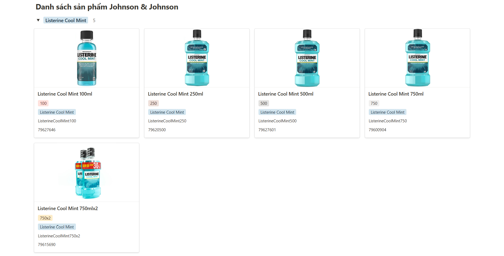
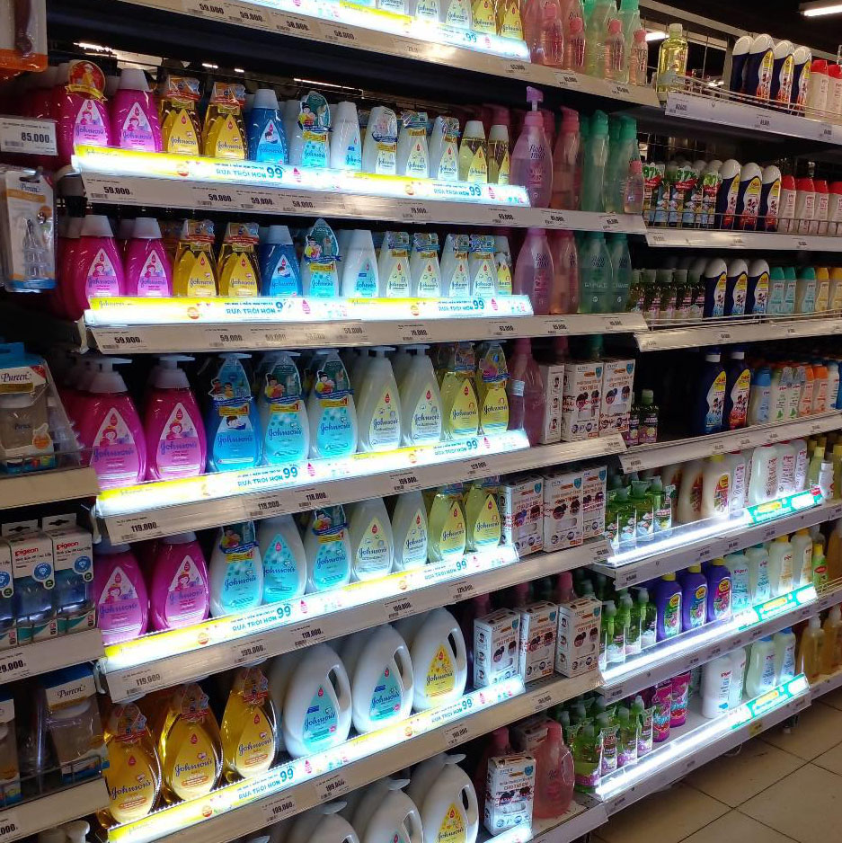

# [AI] PD - Tài liệu hướng dẫn

# I. Giới thiệu

- API này cho phép các nhà phát triển tích hợp khả năng nhận diện các sản phẩm của Listerine (Johnson & Johnson) và các sản phẩm đối thủ.
- API cho phép ghép nhiều ảnh thành một và thực hiện nhận diện các đối tượng trong ảnh đã ghép, hỗ trợ nhiều ảnh đầu vào và cung cấp kết quả chi tiết về các đối tượng được nhận diện.

# II. Danh sách sản phẩm nhận diện




# III. Các khuyến nghị cho hình ảnh đầu vào để cho kết quả dự đoán tốt

- **Độ phân giải tối thiểu**: Để nhận diện dãy sản phẩm trên kệ một cách chính xác, độ phân giải tối thiểu nên đủ lớn để hiển thị chi tiết của sản phẩm và kệ. Điều này bao gồm đặc điểm quan trọng như vị trí và hình dạng của sản phẩm, các nhãn, và các chi tiết quan trọng khác. Không có một con số cụ thể cho độ phân giải tối thiểu của hình ảnh, tuy nhiên dựa vào kinh nghiệm thực tế, đề xuất hình ảnh đầu vào (dạng .jpg hoặc .png) nên có kích thước cạnh ngắn tối thiểu >800px.
- **Khoảng cách và góc nhìn**: Nếu sản phẩm nằm ở khoảng cách xa và nghiêng đối với máy ảnh, bạn có thể cần kích thước lớn hơn để đảm bảo nhận diện chính xác. Để đảm bảo chất lượng nhận diện, khuyến nghị khi chụp hình sản phẩm, mặt phẳng camera phải song song với mặt phẳng dãy kệ.



Góc chụp không được khuyến nghị


Góc chụp khuyến nghị

- **Ánh sáng đầy đủ**: Hãy đảm bảo rằng khu vực bạn chụp ảnh có đủ ánh sáng. Ánh sáng tốt giúp tạo ra hình ảnh sắc nét và giảm thiểu sự mờ hoặc nhiễu.


Hình chụp không được khuyến nghị: chất lượng ánh sáng không tốt


Hình chụp được khuyến nghị: ánh sáng đầy đủ

- **Chất lượng ổn định**: Đảm bảo rằng máy ảnh ổn định và không rung lắc trong quá trình chụp.


Hình chụp không được khuyến nghị: ảnh mờ nhòe


Hình chụp khuyến nghị: ảnh đủ rõ nét

- **Tránh bóng đổ hoặc ánh sáng chói**: Hạn chế bóng đổ hoặc ánh sáng chói trực tiếp lên sản phẩm hoặc kệ. Bóng đổ có thể làm mất thông tin quan trọng trên sản phẩm.


Hình chụp không được khuyến nghị: sản phẩm bị chói làm mất thông tin


Hình chụp khuyến nghị: sản phẩm bị chói nhưng vẫn giữ được thông tin

- **Vật thể bị che lấp**: Nhận diện các vật thể nằm sau vật thể khác luôn là thách thức với các mô hình thị giác máy tính. Nếu vật thể bị thiếu thông tin và không có các đặc điểm rõ ràng, mô hình sẽ khó phân biệt. Tuy nhiên không có gì cần khuyến nghị ở đây, điều này chỉ ra rằng các mô hình thường sẽ nhận diện tốt với lớp đầu tiên trên dãy kệ, và bỏ qua các lớp đằng sau.


Vật thể bị che lấp nhưng vẫn đủ thông tin để phân biệt


Mô hình chỉ nhận diện được các vật thể ở lớp đầu tiên

# IV. Hướng dẫn Sử Dụng API Nhận Diện Sản Phẩm

## 1**. Dữ liệu đầu vào**

- Gửi yêu cầu với một hoặc nhiều ảnh đầu vào dưới dạng jpg hoặc png, key là `image`.

## 2 **Cách gửi yêu cầu**

- Để gửi yêu cầu đến API, sử dụng phương thức POST và truy cập endpoint **`http://izmthxfxxc.ap-southeast-1.awsapprunner.com/objectdetection/`**
- Ví dụ:

```bash
curl -X POST -H "Content-Type: multipart/form-data" -F "image=@đường/dẫn/tới/hình/ảnh1.jpg" -F "image=@đường/dẫn/tới/hình/ảnh2.jpg" http://**izmthxfxxc.ap-southeast-1.awsapprunner.com**/objectdetection/
```

- Đảm bảo có các file ảnh thích hợp (**`image1.jpg`** và **`image2.jpg`**).

## 3**. Yêu cầu đa ảnh và ghép ảnh**

- Để gửi yêu cầu đến API, sử dụng phương thức GET và truy cập endpoint **`http://izmthxfxxc.ap-southeast-1.awsapprunner.com/download`**
- Nếu bạn muốn ghép nhiều ảnh thành một, chỉ cần gửi nhiều ảnh trong yêu cầu. Ứng dụng sẽ tự động ghép ảnh và trả về kết quả.
- Nếu các ảnh không đủ số keypoint (điểm tương đồng để ghép), sẽ trả về thông báo lỗi. Trong quá trình test api, cần ghi nhận lại các trường hợp thành công và không thành công để làm cơ sở điều chỉnh lại ngưỡng tin cậy (tăng hay giảm mức độ chấp nhận các keypoint) và các thông số khác để việc ghép ảnh được đúng với yêu cầu.
- Hình gốc:


- Kết quả:


- Ghi chú: khi chụp hình nên để mặt phẳng camera phải song song với mặt phẳng dãy kệ, điểm nối giữa 2 hình tối thiểu khoảng 1/5 chiều rộng hình để có kết quả ghép tốt hơn.

## 4**. Dữ Liệu Đầu Ra**

Dữ liệu đầu ra sẽ được trả về dưới định dạng JSON và bao gồm thông tin chi tiết về các đối tượng được nhận diện, bao gồm tên lớp, độ chắc chắn, và vị trí bbox.

API sẽ trả về một dictionary chứa thông tin về các đối tượng đã nhận diện. Mỗi đối tượng được đánh số thứ tự và có chứa các thông tin sau:

- "bbox": Tọa độ bounding box của đối tượng.
- "class_name": Tên của đối tượng (sản phẩm), với sản phẩm Listerine, số cuối mã là dung tích sản phẩm tính theo ml.
- "confidence": Độ tin cậy của nhận diện.
- “sku”: mã sản phẩm

```python
{
    "dimension": {
        "height": [
            1500
        ],
        "width": [
            1500
        ]
    },
    "results": {
        "0": {
            "bbox": [
                1003,
                968,
                1392,
                1499
            ],
            "class_name": "ListerineNaturalGreenTea750",
            "confidence": 0.97,
            "sku": 433023338
        }
	}
}

```

**Coco Format:**

*[x_min, y_min, width, height]*

**Pascal_VOC Format:**

*[x_min, y_min, x_max, y_max]*


## 5**. Tải Ảnh Ghép**

- Nếu quá trình ghép ảnh thành công, bạn có thể tải ảnh đã ghép bằng cách sử dụng endpoint **`http://izmthxfxxc.ap-southeast-1.awsapprunner.com/download`**.
- Ảnh sẽ được trả về dưới dạng tệp đính kèm.
- Ví dụ:

```bash
curl -O http://**izmthxfxxc.ap-southeast-1.awsapprunner.com**/download
```

- Tệp ảnh đã ghép sẽ được tải về và lưu vào thư mục hiện tại với tên là **`output_stitched.jpg`**.
- Lưu ý rằng cú pháp cụ thể của **`curl`** có thể thay đổi tùy thuộc vào hệ điều hành đang sử dụng. Đối với Windows, bạn có thể cần sử dụng  bằng cách cài đặt các công cụ như Git Bash hoặc WSL.

